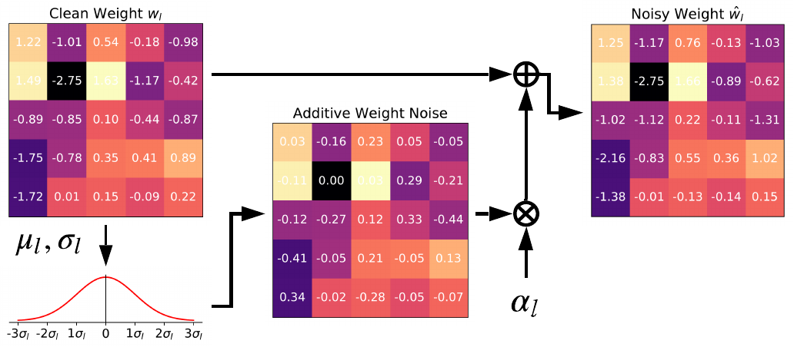

# Paramertic Noise Injection for Adversarial Defense

[](https://996.icu)


This repository contains a Pytorch implementation of our paper titled "[Parametric Noise Injection: Trainable Randomness to Improve Deep Neural Network Robustness against Adversarial Attack](./CVPR19_PNI.pdf)"

If you find this project useful to you, please cite [our work](./CVPR19_PNI.pdf):

```bibtex
@inproceedings{he2019PNI,
 title={Parametric Noise Injection: Trainable Randomness to Improve Deep Neural Network Robustness against Adversarial Attack},
 author={He, Zhezhi and Adnan Siraj Rakin and Fan, Deliang},
 booktitle={Proceedings of the IEEE Conference on Computer Vision and Pattern Recognition},
 pages={},
 year={2019}
}
```

## Table of Contents

- [Introduction](#Introduction) 
- [Dependencies](#Dependencies)
- [Usage](#Usage)
    - [Train](#Train)
    - [Evaluation](#Evaluation)
- [Notes for Experiments setup](#Notes-for-Experiments-setup )
- [Result](#Result)


## Introduction:
Parametric Noise Injection (PNI) is a technique to improve the robustness of deep neural network against the well-known adversarial attack. We want to highlight that PNI can improve both the clean-data (i.e., attack free) accuracy and perturbed-data (i.e., under attack) accuracy.


<!-- <object data="./pics/flowchart.pdf" type="application/pdf" width="700px" height="700px">
    <embed src="./pics/flowchart.pdf">
        <p>This browser does not support PDFs. Please download the PDF to view it: <a href="./pics/flowchart.pdf">Download PDF</a>.</p>
    </embed>
</object> -->



The key idea is simple and the intuition behind it is straight-forward. For each iteration of network inference, We inject the noise sampled from the Gaussian distributed noise source upon weight (input/activation), in a layer-wise fashion. Such Gaussian noise source is trained with the aid of adversarial training (i.e., min-max optimization). The intuition that optimizer will find a moderate noise level is:
- If the noise magnitude is too large, it will introduce too much randomness into the network inference path, thus significantly lower the inference accuracy.

- If the noise magnitude is too small, the regularization functionality of noise injection is not performed. The famous regularizer -- Dropout can be conducted through Gaussian noise injection but with the fixed configuration.

In our paper, only the layer-wise PNI is discussed, but we also test the [channel-wise/element-wise counterparts](#Result), where channel-wise variant shows the best performance.


## Dependencies:
  
  
* Python 3.6 (Anaconda)
* Pytorch >=4.1
* TensorboardX 
  
<!-- ## Set up A Conda python Environment
Anaconda allows you to have different environments installed on your computer to access different versions of `python` and different libraries. Sometimes, the conflict of library versions may causes errors and packages not working. -->

<!-- Use class="notice" for blue notes, class="warning" for red warnings, and class="success" for green notes.

<div class="Notice">
You must replace `meowmeowmeow` with your personal API key.
</div> -->
  
  
## Usage
Please modify the example bash code (`train_cifar.sh` and `eval_cifar.sh`) we provide for running the code.

```bash
HOST=$(hostname)
echo "Current host is: $HOST"

case $HOST in
"alpha")
    # python environment path
    PYTHON="/home/elliot/anaconda3/envs/pytorch_041/bin/python" 
    # tensorboard path
    TENSORBOARD='/home/elliot/anaconda3/envs/pytorch_041/bin/tensorboard'
   ;;
esac

data_path=''
```

### Train
```bash
bash train_cifar.sh
```
- `model`: Set `model=vanilla_resnet20` for baseline adversarial training. Set `model=noise_resnet20` for adversarial training with PNI technique. For switching the layer/channel/element-wise PNI on weight, please modify the model definition in [models/noise_layer.py](). For example:
    ```
    ```


- `epoch_delay`: Number of epochs that delaying the adversarial training, where the default setup is 5. You can disable it by setting `--epoch_delay 0` in the bash script.

- `adv_eval`: through enabling the adversarial evaluation, users can monitor the accuracy of perturbed test data (i.e., input image under attack) evolving with the adversarial training progress. For fast training, users can also choose to disable the evaluation, then only perfrom the evaluation with the model after adversarial traning.

### Evaluation
```bash
bash eval_cifar.sh
```
-  Change the `pretrained_model=` in `eval_cifar.sh` for the target model.

## Notes for Experiments setup

1. Based on our experiments, since the PNI-W (i.e., Parametric Noise Injection on Weight) outperforms other PNI variants on activations and etc., we choose PNI-W as the default setup.

2. Previous works remove the normalization layer from the data-preprocessing. Since we still expect the fast convergence benefit from the normalization of input image, we add a normalization in front of the neural network which perform the identical functionality but with the normalization incoporated within the backward computation graph.

3. During the adversarial training, we take the prevention of label leaking into the consideration. Rather than directly use the groundtruth as the label to perform the adversarial attack, we take the network's output w.r.t the clean data (i.e., attack free) as the label.


## Result
Hereby, we choose the ResNet-20 on CIFAR-10 as a simple example. Besides the Layer-wise PNI we introduced in our paper, we also implement the PNI in channel-wise and element-wise fashion. 

|      | Clean data | PGD | FGSM |
|:----:|:---------:|:---------:|:---------:|
| vanilla adv. training |83.84%|39.14$\pm$0.05%|46.55%|    
| PNI-W (layer-wise) |84.89$\pm$0.11%|45.94$\pm$0.11%|54.48$\pm$0.44%| 
| PNI-W (channel-wise) |85.17$\pm$0.12%|48.40$\pm$0.37%|56.51$\pm$0.75%| 
| PNI-W (element-wise) |80.69$\pm$0.16%|49.07$\pm$0.41%|55.13$\pm$0.51%|   


